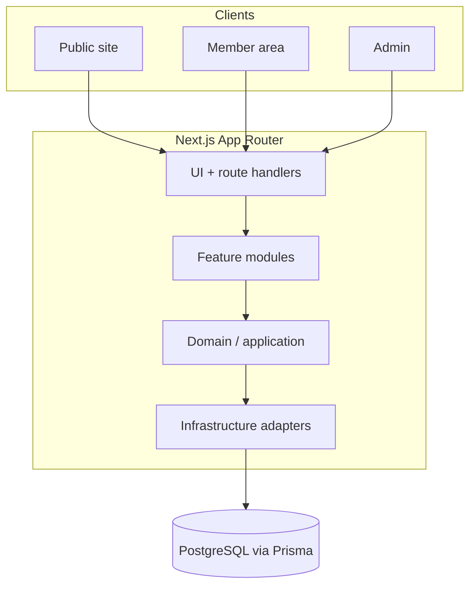

# Gear31

Brazilian automotive community platform — public site, member area, admin, store, events, and content.

## Problem / What it does

Car enthusiasts need a single place for garages, projects, events/meets, blog content, partners, and a store. Gear31 is a full-stack community product with a public marketing site, membership/account flows, and an admin surface, organized around automotive social features.

## Key features

- Public site routes for home, about, garages, projects, blog, events/meets/rolezinhos, groups, forum, partners, store/cart/checkout, premium, and legal pages
- Feature modules for auth, members/memberships, CMS/blog, events, garages, projects, groups, store, ads/affiliates, SEO, analytics, CRM, and admin
- Clean Architecture layout: domain, application, infrastructure, and Next.js App Router UI
- Health API checking app status and PostgreSQL connectivity
- Prisma foundation (settings, feature flags, audit logs)
- Docker / Docker Compose local parity; Cloud Build config for container deployment
- Zod-validated environment boundary; Vitest for tests

## Tech stack

- **Frontend / app:** Next.js (App Router), React, TypeScript, Tailwind CSS
- **Data:** PostgreSQL, Prisma, Zod
- **Auth / services:** Firebase client & Firebase Admin (present in dependencies)
- **Quality:** ESLint, Prettier, Vitest
- **Ops:** Docker, Docker Compose, Google Cloud Build

## Architecture overview

Canonical product domains referenced in project docs: `gear31.club` (primary) with `gear31.com.br` as alternate redirect.

## My role

Designed and built by Anderson Henrique Gonçalves.

## Status

In development — substantial UI routes and module scaffolding are present; architecture docs describe foundation and planned capabilities. Treat as an active product build, not a finished production release.

## Source code

Source code is private. Available for walkthrough on request.

- LinkedIn: https://www.linkedin.com/in/andersonhenriquegoncalves
- GitHub: https://github.com/anderzilla
